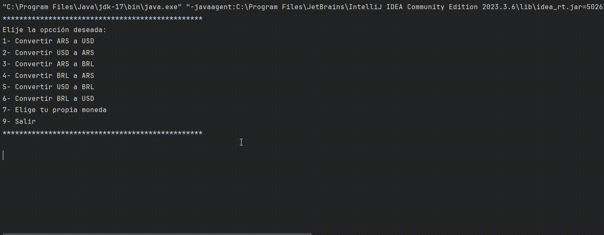

# Conversor de Moneda - Desafío Alura-ONE

## Descripción
Este proyecto fue porpuesto en el programa de Alura-One de la siguiente forma:

En este emocionante desafío de programación, te invitamos a construir tu propio Conversor de Monedas.
Aprenderás a realizar solicitudes a una API de tasas de cambio, a manipular datos JSON y, finalmente, a filtrar y mostrar las monedas de interés.
¡Prepárate para una experiencia práctica y emocionante en el desarrollo Java!

Los pasos para completar este desafío se detallarán a continuación y estarán disponibles en la sección adyacente:

Configuración del Ambiente Java;
Creación del Proyecto;
Consumo de la API;
Análisis de la Respuesta JSON;
Filtro de Monedas;
Exibición de Resultados a los usuarios;
¡Prepárate para sumergirte en una experiencia práctica y emocionante en el desarrollo Java!

*******************************************************************************************

La API que usé fue: [ExchangeRate-API](https://www.exchangerate-api.com/)

Nota personal: Fue muy desafiante, ya que fué mi primer poyecto donde consumia una API.

## Demostración
En el gif expliactivo 1 pueden ver de forma general el funcionamiento del programa desde la terminal.
Estaba probando cómo respondia el try-catch general, y se me ocurrió que podia introducir uno más especifico, el cual implemento de forma parcial en el gif explicativo 2.

Nota personal: Al proyecto le falta bastante, pero con constancia se puede mejorar!

### GIF explicativo 1:

### GIF explicativo 2:

### GIF explicativo 3: 
Esta opción quizas sea el más interesante, ya que permite ver bien el funcionamiento de todos los requicitos del desafío.
Se puede usar cualquier moneda siempre que se conozca su currency code. Pueden encontrar todos los currency code en la siguiente página: [API](https://www.exchangerate-api.com/docs/java-currency-api)

## Agradecimientos

- Agradezco a [AluraLatam](https://www.linkedin.com/company/alura-latam/) y [Oracle-ONE](https://www.linkedin.com/company/oracle/) por su ayuda, orientación y oportunidad.
- Agradezco a los profesores [Génesys Rondón](https://www.linkedin.com/in/genesysrondon914762182/) y [Bruno Darío Fernández Ellerbach](https://www.linkedin.com/in/brunofernandezellerbach/) por sus enseñanzas y orientación a traves de los videos para realizar este proyecto.

## Contribución

Si deseas contribuir a este proyecto, sigue estos pasos:
1. Haz un Fork del proyecto
2. Crea una nueva rama (`git checkout -b feature/nueva-caracteristica`)
3. Haz tus cambios y haz commit de ellos (`git commit -am 'Agrega nueva característica'`)
4. Haz push de la rama (`git push origin feature/nueva-caracteristica`)
5. Abre un Pull Request
